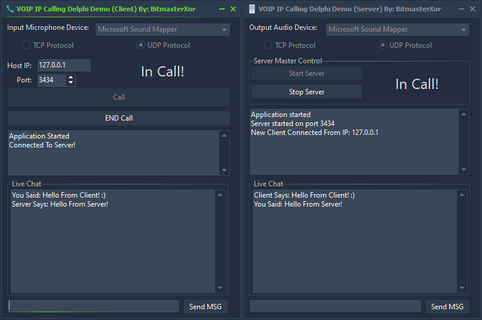

<h1>Delphi VOIP and Chat Applications</h1>

This repository contains two Delphi VCL projects designed for VOIP communication and real-time text chat using the <strong>VC (Voice Chat) components</strong> by LakeOfSoft. These components are included in this repository for your convenience, available in two versions:

<ul>
  <li><strong>Version for Delphi 4 to Delphi XE3:</strong> This version is compatible with older Delphi environments.</li>
  <li><strong>Version for Delphi 12.2 Athens:</strong> A partially re-written and fixed version to ensure compatibility with the latest Delphi release.</li>
</ul>

These applications facilitate audio streaming and messaging for a single-client server connection.

<!-- Add a screenshot or preview image of the applications -->

  

<h2>Projects Overview</h2>
<ul>
  <li><strong>VOIP Server Project:</strong> Handles a single client connection for audio streaming and basic text chat functionality.</li>
  <li><strong>VOIP Client Project:</strong> Connects to the server, allowing two-way audio streaming and text-based chat with the server.</li>
</ul>

<h2>Features</h2>
<ul>
  <li><strong>Audio Streaming:</strong> Full-duplex audio streaming between server and client using user-selectable audio devices.</li>
  <li><strong>Real-Time Text Chat:</strong> Allows for messaging between the client and server in real-time.</li>
  <li><strong>Protocol Flexibility:</strong> Supports both TCP and UDP communication modes.</li>
  <li><strong>Single Client Connection:</strong> Server accepts only one client connection at a time for focused communication.</li>
  <li><strong>Configurable Bitrate:</strong> By default, the components are set to their standard PCM bitrate. Users can easily add code to modify the bitrate as needed to suit different audio quality requirements.</li>
</ul>

<h2>Installation</h2>
<ol>
  <li><strong>Requirements:</strong> Delphi with the VC (Voice Chat) components included in this repository, located in the <code>VC Audio Components For Delphi</code> folder, for audio and socket operations.</li>
  <li><strong>Download and Open Project:</strong> Clone this repository and open the `.dpr` files in Delphi for each project.</li>
  <li><strong>Compile:</strong> Build both projects to generate the executables for the client and server.</li>
  <li><strong>Run:</strong> Start the server application first, followed by the client.</li>
</ol>

<h2>Usage</h2>
<ol>
  <li><strong>Server Setup:</strong> Enter a port and start the server to listen for an incoming connection.</li>
  <li><strong>Client Connection:</strong> Enter the server's IP address and port on the client, select TCP or UDP, and connect.</li>
  <li><strong>Audio and Chat:</strong> Use the client’s chat interface to send text messages and the integrated audio devices for VOIP streaming.</li>
  <li><strong>Adjusting Bitrate:</strong> To change the default PCM bitrate, add custom code to the audio component settings in Delphi for enhanced audio quality control.</li>
  <li><strong>Disconnection:</strong> Click the disconnect button on the client to end the connection gracefully.</li>
</ol>

<h2>Contributing</h2>

Contributions are welcome! Please fork this repository, make your changes, and submit a pull request with any bug fixes or enhancements.

<h2>License</h2>

This project is open source and provided "as is" without warranty. Use at your own risk.

<h2>📧 Contact</h2>

Discord: bitmasterxor

Made with ❤️ by BitmasterXor, using Delphi RAD Studio

